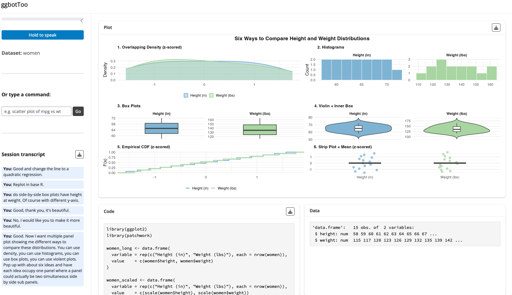

# ggbotToo

Voice-controlled R plotting. Speak a command, get a ggplot2 plot. Free, local, no API key needed.

A free, local alternative to the brilliant [ggbot2](https://github.com/tidyverse/ggbot2), which inspired this project but requires a paid API key. Runs entirely on your machine using [Ollama](https://ollama.com) and [Whisper](https://github.com/openai/whisper).

**Heads up:** This package runs AI models locally on your Mac. First-time setup downloads ~9GB of model files. After that, everything runs offline — no internet or API keys needed.



---

## Requirements

- Mac with Apple Silicon (M1/M2/M3)
- R >= 4.3
- [Ollama](https://ollama.com) — free, runs LLMs locally

---

## Installation

**Step 1 — Install Ollama** (one time)

Download the Mac app from [ollama.com](https://ollama.com) and drag it to Applications. When you launch it, a small llama icon appears in your menu bar — that means the Ollama server is running in the background. (If you prefer Homebrew: `brew install ollama`.)

**Step 2 — Install the R package**

```r
remotes::install_github("bnosac/audio.whisper")
remotes::install_github("josh-goldstein-git/ggbotToo")
```

> **Note:** `audio.whisper` compiles C++ code from source. If the install fails, you likely need Apple's Command Line Tools. Open Terminal and run `xcode-select --install`, follow the prompts, then try again.

**Step 3 — First-time setup** (downloads models, one time)

```r
library(ggbotToo)
ggbot_setup()
```

This will:
- Check Ollama is running (make sure the llama icon is in your menu bar)
- Pull the default language model (`deepseek-coder-v2:lite`, ~9GB)
- Download the Whisper speech-to-text model (~75MB)

---

## Usage

```r
library(ggbotToo)
ggbot(mtcars)
```

Pass any data frame (or tibble). This opens a Shiny app in your browser. Hold the **Hold to speak** button and describe the plot you want. Release to transcribe and generate. You can also type commands in the text box.

**Default model:** `deepseek-coder-v2:lite` — good balance of quality and speed.
Switch models in the sidebar dropdown, or pass at startup:

```r
ggbot(mydata, model = "qwen2.5-coder")
```

---

## Walkthrough

Here is a typical session using the Palmer Penguins dataset. Each step shows what you would say (or type) and what the app produces.

**Setup:**
```r
library(ggbotToo)
library(palmerpenguins)
ggbot(penguins)
```

**Step 1** — Hold the button and say in a clear voice: *"scatter plot of bill length by bill depth"*

The app transcribes your speech, sends it to the LLM, and displays a basic scatter plot. You see the ggplot2 code in the Code panel and the plot in the Plot panel.

**Step 2** — Say: *"color the points by species"*

The app remembers the previous plot and adds `color = species` to the aesthetic mapping.

**Step 3** — Say: *"add a smooth regression line"*

A `geom_smooth()` layer is added on top of the existing scatter plot.

**Step 4** — Say: *"add a title Penguin Bill Dimensions"*

`ggtitle("Penguin Bill Dimensions")` is appended to the plot.

**Step 5** — Say: *"make the axis labels larger"*

The theme is updated with larger axis text. Each refinement builds on the previous code — nothing is lost.

If the generated code has an error, the app automatically asks the LLM to fix it and retries once. If the plot goes off the rails, just say *"start over, give me a histogram of bill length"* — the LLM will discard the current code and begin fresh. Each session works with a single data frame — to switch datasets, close the app and call `ggbot()` again with the new data.

---

## Notes

- Run `ggbot()` in a **dedicated R session** — Shiny blocks the console
- Make sure the Ollama llama icon is visible in your menu bar before running
- First run after install will be slow (model loading); subsequent runs are faster
- The app works best with column names that are real words — it reads your data structure and uses it to interpret your commands
- Also supports base R / tinyplot: `ggbot(mydata, prompt = "baseR")`

---

## How it works

```
browser mic → Whisper (local STT) → Ollama LLM → ggplot2 code → plot
```

Audio is captured in the browser and transcribed locally with Whisper. The transcript is sent to a local Ollama model which generates R code. The code is evaluated and the plot is displayed — nothing leaves your machine.
